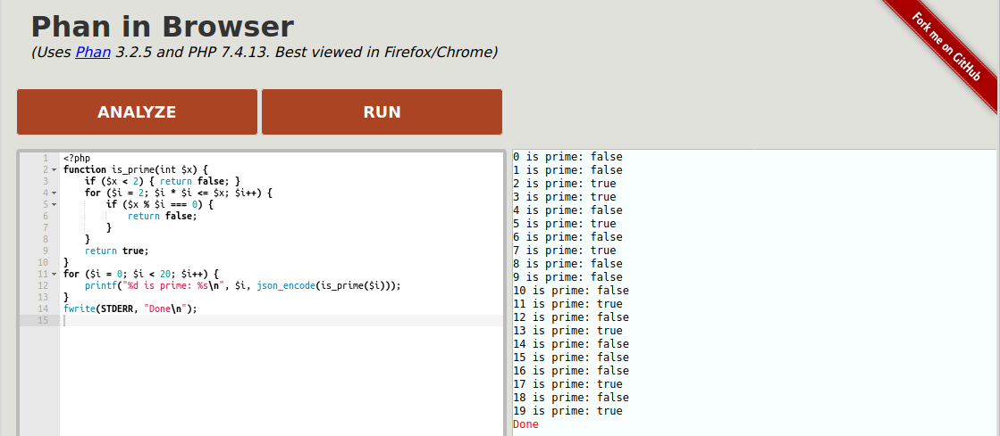

# Phan in Browser

[Run Phan in your browser](https://phan.github.io/demo/) (Requires Firefox/Chrome and at least 4GB of free RAM)].

[](https://phan.github.io/demo/)
[](https://phan.github.io/demo/)

- This uses emscripten to allow analyzing (or running) PHP scripts entirely in your browser.

PHP Version: 7.4.13

[Phan](https://github.com/phan/phan) Version: 3.2.5

This is based on [oraoto/pib](https://oraoto.github.io/pib/) (PHP In Browser)

There is also a [demo for PHP 8.0.0-dev](https://phan.github.io/demo/8/)

## Building From Source

### Using Docker

TODO: would these instructions work for phan/demo?

The quickest way to build PIB is by using Docker:

```
docker run --rm -v $(pwd):/src trzeci/emscripten:sdk-incoming-64bit bash -c `apt-get update && apt-get install -y autoconf; build.sh`
```

### Setup Emscripten SDK (emsdk) manually

Steps:

1. Setup emsdk (>= 3.0.9), see [Installation Instructions](https://emscripten.org/docs/getting_started/downloads.html#installation-instructions)
2. Run `bash build.sh` (Install `autoconf` if needed)

## Running locally

This requires that a web server be running and serve static files.
`python3 -m http.server --bind 127.0.0.1 8080` (from the root directory of phan-demo) is one way to do this.
Then, open http://localhost:8080/

## Acknowledgements

This application is based on [PHP in Browser (oraoto/pib)](https://github.com/oraoto/pib).

The Web UI is based on [Rust Playground](https://play.rust-lang.org/).
This uses the [ace](https://ace.c9.io/) editor.
