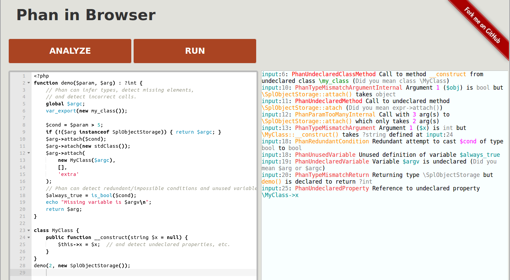

# Phan in Browser

[Run Phan in your browser](https://tysonandre.github.io/phan-demo/) (Requires Firefox and at least 4GB of free RAM)].

[](https://tysonandre.github.io/phan-demo/)

- This uses emscripten to allow analyzing (or running) PHP scripts entirely in your browser.

PHP Version: 7.3.7
[Phan](https://github.com/phan/phan) Version: 2.2.7-dev

This is based on [oraoto/pib](https://oraoto.github.io/pib/) (PHP In Browser)

## Known issues

+ Fatal errors (e.g. duplicate classes) do not get reported.
+ Parsing all of the emscripten code can require gigabytes of memory.
+ Chrome shows the "Aw, Snap" page (e.g. when you stop using the tab)

## Building From Source

### Using Docker

TODO: would these instructions work for phan-demo?

The quickest way to build PIB is by using Docker:

```
docker run --rm -v $(pwd):/src trzeci/emscripten:sdk-incoming-64bit bash build.sh
```

### Setup Emscripten SDK (emsdk) manually

Steps:

1. Setup emsdk (>= 1.38.11), see [Installation Instructions](https://github.com/juj/emsdk#installation-instructions)
2. Run `bash build.sh`

## Running locally

This requires that a web server be running and serve static files.
`python 3 -m http.server --bind 127.0.0.1 8080` (from the root directory of phan-demo) is one way to do this.
Then, open http://localhost:8080/

## Acknowledgements

This application is based on [PHP in Browser (oraoto/pib)](https://github.com/oraoto/pib).

The Web UI is based on [Rust Playground](https://play.rust-lang.org/).
